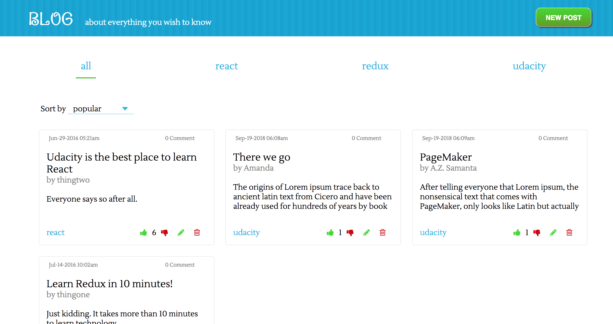
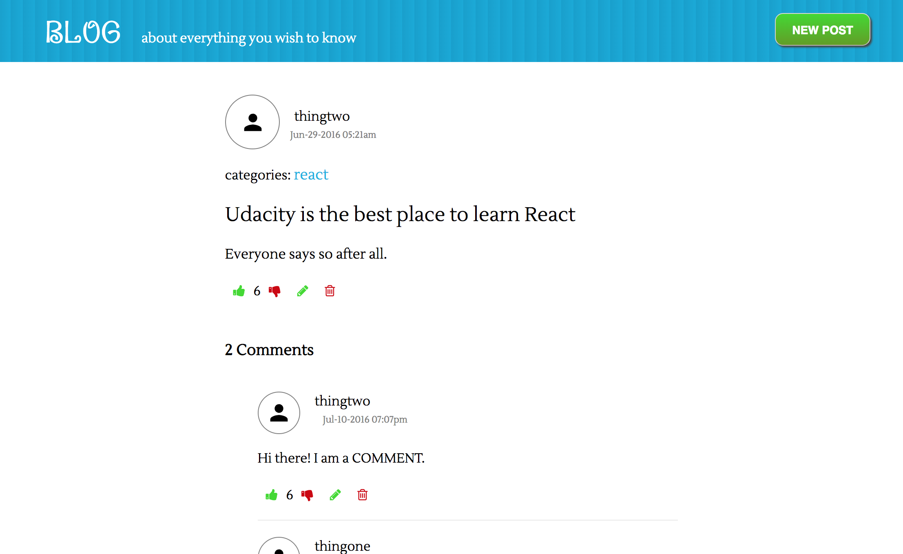

# Project Overview
This project is the second task of Udacity Nanodegree Program on React & Redux.
Readable is a dynamic social web application using the state management features of Redux and React.
Users are able to post content to predefined categories.

Page of one posts

Users are able to comment on their posts and other users' posts, and vote on posts and comments, as well as to edit and delete them

# Getting Started
0. This app requires npm to build, if Node and npm are not installed on your device, you should install it first. More info can be found [here](https://docs.npmjs.com/getting-started/installing-node)
1. Clone git repo
2. cd into frontend directory and run `npm install`
3. cd into api-server directory, run `npm install` and run server with `npm start`
4. cd into frontend directory and run local host with `npm start`. This will open app in http://localhost:3000
